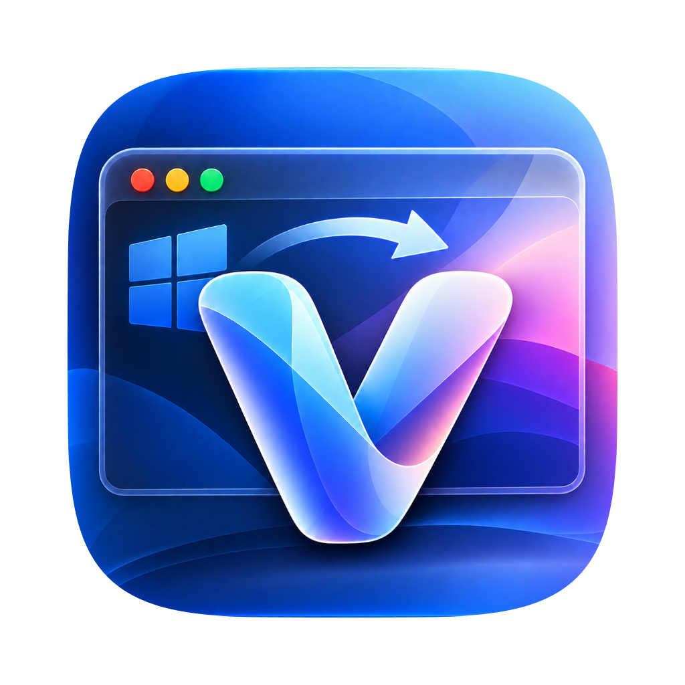

<p align="center">
  
</p>

<h1 align="center">VeliShell</h1>

<p align="center">
  Ein ruhiges, frei anpassbares Dock für Windows – mit macOS-inspirierter Bedienung,<br>
  sauberer Fensterintegration und einem Design, das sich nicht in den Vordergrund drängt.
</p>

<p align="center">
  <a href="https://github.com/ZUMBYTE-AppSolution/VeliShell/releases/latest/download/VeliShell-Setup-win-x64.msi"><strong>⬇️ Installer herunterladen</strong></a>
  ·
  <a href="https://github.com/ZUMBYTE-AppSolution/VeliShell/releases/latest/download/VeliShell-Portable-win-x64.zip">📦 Portable Version</a>
  ·
  <a href="https://github.com/ZUMBYTE-AppSolution/VeliShell/releases/latest">📝 Neueste Version</a>
</p>

<p align="center">
  
  
  
</p>

---

## ✨ Was VeliShell ausmacht

VeliShell ersetzt nicht die Windows-Shell. Es ergänzt den Desktop um ein Dock, das sich vertraut anfühlt und trotzdem Windows respektiert.

- **Einheitliche App-Icons:** Jedes Symbol belegt exakt dieselbe eingestellte Fläche. Transparente Ränder oder ungewöhnliche Quelldateien verändern die Größe im Dock nicht.
- **Gemeinsame Rundung:** App-Icon, geladene Icons, Hover-Zustand und Drag-Ghost verwenden dieselbe kontinuierliche Superellipse.
- **Drag & Drop wie erwartet:** Programme, Dateien und Ordner lassen sich vom Desktop ins Dock ziehen, im Dock verschieben und wieder als Verknüpfung herausziehen. Der Ghost sitzt direkt am künftigen Einfügeplatz.
- **Fenster auf einen Blick:** Laufende Apps erhalten einen einzelnen Punkt. Bei mehreren Fenstern zeigt das Kontextmenü seitlich eine Live-Miniatur des gerade berührten Eintrags.
- **Papierkorb im Dock:** Leer- und Vollzustand haben eigene Symbole; der Papierkorb lässt sich direkt über das Dock leeren.
- **Milchiger Hintergrund:** Helles und dunkles Design, weiche Transparenz und eine zurückhaltende Vergrößerung beim Darüberfahren.
- **VeliShell-Farbwelt:** Einstellungen, Info und Update-Dialog passen sich mit gut lesbaren Blau-Cyan-Violett-Verläufen, sanftem Glow und eigener Hell-/Dunkelabstimmung an das Markensignet an.
- **Skalierbar:** Die Icongröße lässt sich von 32 bis 96 DIP einstellen und bleibt auch bei Windows-Skalierung sauber zentriert.
- **Windows-Taskleiste optional ausblenden:** Nur nach ausdrücklicher Aktivierung, inklusive Notfall-Tastenkürzel und Wiederherstellung beim normalen Beenden.
- **Deutsch, Englisch oder Systemsprache:** Die Sprache kann jederzeit in den Einstellungen gewechselt werden.

## 🚀 Installation

1. Den [aktuellen VeliShell-Installer](https://github.com/ZUMBYTE-AppSolution/VeliShell/releases/latest/download/VeliShell-Setup-win-x64.msi) herunterladen.
2. Die MSI-Datei öffnen, die Windows-Administratorabfrage bestätigen und den gebrandeten VeliShell-Dialogen folgen. Der optionale Hintergrunddienst ist dabei standardmäßig abgewählt.
3. VeliShell über das Startmenü starten und das Dock nach Wunsch einrichten.

Für einen Test ohne Installation gibt es zusätzlich eine [portable ZIP-Datei](https://github.com/ZUMBYTE-AppSolution/VeliShell/releases/latest/download/VeliShell-Portable-win-x64.zip). Sie muss vollständig entpackt werden; die EXE allein reicht nicht aus.

> [!IMPORTANT]
> Die ersten Releases können noch ohne kostenpflichtiges Herausgeberzertifikat erstellt sein. Windows SmartScreen kann deshalb warnen. Die Release-Seite enthält SHA-256-Prüfsummen und eine von GitHub erzeugte Build-Herkunftsbestätigung. Sicherheitsfunktionen von Windows müssen dafür nicht abgeschaltet werden.

## 🧭 Die wichtigsten Handgriffe

| Aktion | Bedienung |
|---|---|
| Einstellungen öffnen | VeliShell-Icon im Dock oder `Strg` + `Alt` + `V` |
| App anheften | Datei, Ordner oder Verknüpfung auf das Dock ziehen |
| Reihenfolge ändern | Icon im Dock an die gewünschte Position ziehen |
| Verknüpfung herausziehen | Dock-Icon auf Desktop oder Explorer ziehen |
| Mehrere Fenster auswählen | Rechtsklick auf die laufende App |
| Papierkorb leeren | Rechtsklick auf den Papierkorb |
| Taskleiste im Notfall einblenden | `Strg` + `Alt` + `Umschalt` + `F11` |
| VeliShell beenden | Dock-Menü oder `Strg` + `Alt` + `Umschalt` + `Q` |

## 🔄 Updates ohne Überraschungen

VeliShell fragt GitHub ausschließlich nach der neuesten veröffentlichten Version. Das Verhalten bestimmst du selbst: nur manuell prüfen, bei neuen Versionen benachrichtigen oder das geprüfte Paket automatisch herunterladen. Das vollständige Changelog bleibt dabei sichtbar; die Installation beginnt nie von allein.

- automatische Downloads nur nach ausdrücklicher Auswahl in den Einstellungen;
- keine unbeaufsichtigte Installation;
- Größen- und SHA-256-Prüfung vor dem Start des Installers;
- deutlicher Hinweis, wenn ein Paket noch keine gültige Windows-Herausgebersignatur besitzt;
- jederzeit auch manuell über **Einstellungen → Info → Nach Updates suchen**.

Die Versionshistorie steht in [CHANGELOG.md](CHANGELOG.md). Jede stabile Version erhält zusätzlich einen eigenen Eintrag unter [GitHub Releases](https://github.com/ZUMBYTE-AppSolution/VeliShell/releases).

## 🖥️ Autostart und Hintergrunddienst

Beides ist freiwillig und standardmäßig ausgeschaltet:

- **Normaler Autostart** startet das sichtbare Dock nach deiner Windows-Anmeldung. Er wird nur für dein Benutzerkonto eingerichtet und kann in VeliShell jederzeit wieder entfernt werden.
- **VeliShell Update Service** ist ein optionaler Hintergrundhelfer. Er darf ausschließlich prüfen, ob eine neue Release-Version vorhanden ist, und lädt oder installiert nichts. Ein Windows-Dienst kann wegen der Windows-Sitzungstrennung kein sichtbares Dock darstellen; dafür bleibt der normale Autostart zuständig.

Der Dienst ist ein eigenes, im Installer standardmäßig abgewähltes Feature. Wenn du ihn bewusst installierst, prüft er unabhängig von der Update-Auswahl der Desktop-App nur die öffentlichen Release-Metadaten; entfernen lässt er sich jederzeit über „Apps & Features“ → VeliShell → Ändern.

## 🎨 Icons von macOS Icon Gallery

Die optionale Online-Suche verwendet den öffentlichen Katalog von [macOS Icon Gallery](https://www.macosicongallery.com/). VeliShell lädt den Katalog erst nach deiner Zustimmung und gleicht App-Namen lokal ab. Nur für einen ausgewählten Treffer wird die zugehörige Bilddatei abgerufen.

VeliShell liefert keine Gallery-Icons mit und beansprucht daran keine Rechte. Die öffentliche Erreichbarkeit eines Bildes ist keine Lizenz zur Weiterverteilung. Quellen- und Rechtehinweise bleiben deshalb sichtbar; weitere Angaben stehen in [THIRD-PARTY-NOTICES.md](THIRD-PARTY-NOTICES.md).

## 🔐 Datenschutz und Sicherheit

- keine Telemetrie und kein Werbe-Tracking;
- Einstellungen und Icon-Cache bleiben lokal auf dem Rechner;
- App- und Fensternamen werden nicht als Suchanfragen an den Icon-Anbieter gesendet;
- Update-Metadaten kommen ausschließlich aus dem offiziellen VeliShell-Repository;
- die Windows-Shell, Systemdateien und Sicherheitsfunktionen werden nicht ersetzt oder deaktiviert.

Lokale Daten liegen unter `%LOCALAPPDATA%\VeliShell`. Diagnoseprotokolle werden nicht automatisch übertragen.

## 🧩 Geplante Erweiterungen

Folgende Punkte stehen als Nächstes auf dem Tisch – ohne festes Veröffentlichungsdatum:

- getrennte Dock-Layouts pro Monitor;
- weitere Sprachen;
- Import und Export eigener Dock-Profile;
- zusätzliche barrierefreie Tastaturbedienung;
- signierte Windows-Releases, sobald die Herausgeberzertifizierung bereitsteht;
- mehr Feinschliff für Touch- und Tablet-Nutzung.

## 🛠️ Aus dem Quellcode bauen

Benötigt werden Windows x64 und das .NET 10 SDK.

```powershell
dotnet build VeliShell.slnx -c Release
dotnet run --project tests/VeliShell.Core.Tests/VeliShell.Core.Tests.csproj -c Release
./tools/Build.ps1 -Portable
```

Der Installer wird reproduzierbar mit WiX Toolset 4 gebaut:

```powershell
./tools/Build-Installer.ps1 -Version 0.3.1 -PublishDirectory ./out/portable
```

## 💬 Support & Kontakt

- 🌐 [Zumbyte AppSolution](https://www.zumbyte.de/)
- 🛟 [Support und Fehler melden](https://github.com/ZUMBYTE-AppSolution/VeliShell/issues)
- ✉️ [info@zumbyte.de](mailto:info@zumbyte.de)
- 🔒 [Sicherheitshinweise](SECURITY.md)

Bitte bei einer Fehlermeldung die VeliShell-Version, die Windows-Version und einen kurzen Ablauf dazuschreiben. Persönliche Dateipfade in Screenshots oder Logs vorher unkenntlich machen.

## ⚖️ Hinweise

VeliShell ist ein eigenständiges Projekt von **Zumbyte AppSolution** und steht in keiner Verbindung zu Apple. macOS, Finder, Safari und weitere Produktnamen sind Marken ihrer jeweiligen Rechteinhaber. Windows und Microsoft sind Marken der Microsoft-Unternehmensgruppe.

VeliShell ist proprietäre Software. Die Nutzungsbedingungen stehen in der
[LICENSE](LICENSE). Danke an die Projekte und Dienste, auf denen VeliShell
aufbaut. Die vollständigen Hinweise befinden sich in
[THIRD-PARTY-NOTICES.md](THIRD-PARTY-NOTICES.md); die mitgelieferten
Originaltexte liegen unter [THIRD-PARTY-LICENSES](THIRD-PARTY-LICENSES/README.md).

<p align="center"><strong>VeliShell · von Zumbyte AppSolution</strong></p>
